``` mermaid
gantt
    title Расписание выполнения заданий
    dateFormat  HH:mm
    axisFormat %H:%M
    section 1
    A :a1, 01:00, 15h
    section 2
    B :b1, 01:00, 6h
    C :c1, after b1, 6h
    D_1 :d1, after c1, 3h
    section 3
    D_2 :d2, 01:00, 2h
    E :e1, after d2, 5h
    F :f1, after e1, 7h
    G_1 :g1, after f1, 1h
    section 4
    G_2 :g2, 01:00, 10h
```

# Задача 1 (Вариант 3):

Имеется 10 независимых заданий, каждое из которых состоит из двух последовательных этапов, и 2 исполнителя, исполнитель 1 выполняет только первый этап задания, исполнитель 2 - только второй. Длительность заданий (по этапам): (5, 8), (5, 10), (6, 6), (9, 7), (7, 5), (6, 9), (3, 5), (7, 4), (7, 9), (5, 6).

## 1. Выбор и обоснование алгоритма

Применим алгоритм Джонсона, так как каждое задание состоит из двух последовательных этапов, и есть два исполнителя, каждый из которых обрабатывает свой этап (конвейерная задача).

## 2. Применение алгоритма

Задания и их длительности по этапам: `A(5, 8)`, `B(5, 10)`, `C(6, 6)`, `D(9, 7)`, `E(7, 5)`, `F(6, 9)`, `G(3, 5)`, `H(7, 4)`, `I(7, 9)`, `J(5, 6)`.

### Разбиение на группы:

| 1 группа | 2 группа |
|----------|----------|
| A(5,8)   | D(9,7)   |
| B(5,10)  | E(7,5)   |
| C(6,6)   | H(7,4)   |
| F(6,9)   |
| G(3,5)   |
| J(5,6)   |
| I(7,9)   |

### Сортировка заданий внутри групп:

Задания из первой группы отсортируем в порядке возрастания величин аi. Задания из второй группы отсортируем в порядке убывания величин bi.

| 1 группа | 2 группа |
|----------|----------|
| G(3,5)   | D(9,7)   |
| B(5,10)  | E(7,5)   |
| A(5,8)   | H(7,4)   |
| J(5,6)   |
| C(6,6)   |
| F(6,9)   |
| I(7,9)   |

### Формирование окончательного порядка выполнения заданий (с первого задания по последнее):
- `G (3, 5)`
- `B (5, 10)`
- `A (5, 8)`
- `J (5, 6)`
- `C (6, 6)`
- `F (6, 9)`
- `I (7, 9)`
- `D (9, 7)`
- `E (7, 5)`
- `H (7, 4)`

## 3. Диаграмма Ганта

## 4. Ответ
Длительность выполнения работ: **67 часов**.

# Задача 2 (Вариант 3):

Имеется 7 независимых заданий и 5 универсальных исполнителей. Длительность заданий: 15(A), 6(B), 6(C), 5(D), 5(E), 7(F), 11(G).

## 1. Выбор и обоснование алгоритма

Исходя из условия задачи, для второй задачи подходит ленточная стратегия, так как исполнители универсальны и задания являются независимыми.

## 2. Применение алгоритма

### Выберем задание с наибольшей длительностью выполнения среди прочих:

$$T_{max} = max(15, 6, 6, 5, 5, 7, 11) =15$$

### Рассчитаем среднюю продолжительность заданий для одного исполнителя:

$$T_{ср} = \frac{\sum t}{5} = \frac{55}{5} = 11$$

### Вычислим оптимальную продолжительность расписания:

$$T = \max(15; 11) = 15$$

### Распределение заданий по ленточной стратегии:

Задания распределяются между исполнителями. Прерывание и продолжение заданий другими исполнителями допускается.

## 3. Диаграмма Ганта

## 4. Ответ

Время, необходимое для выполнения всех заданий в данном расписании, составляет 15 часов.

Наиболее длительное задание (A) занимает 15 часов, и его необходимо выполнить целиком.
