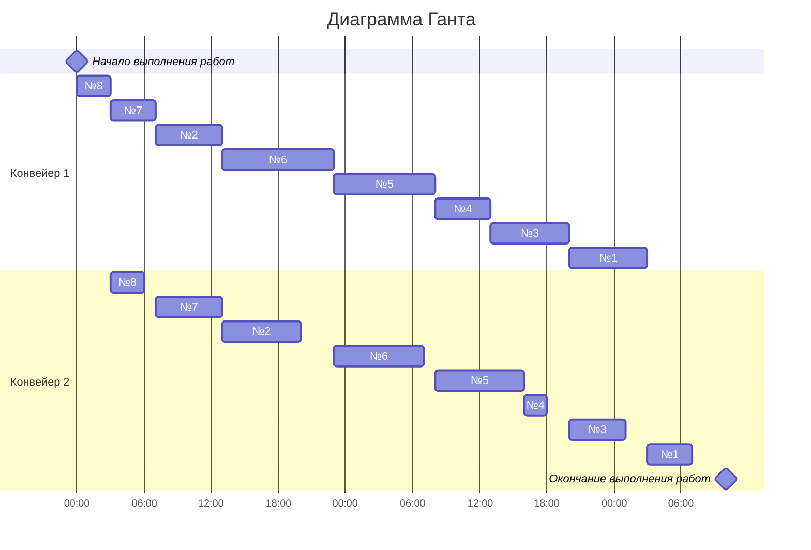

```mermaid
gantt
    title Диаграмма Ганта - Ленточная стратегия для 5 исполнителей
    todayMarker off
    dateFormat  HH:mm    
    axisFormat %H:%M
    Начало выполнения работ : milestone, m1, 00:00, 0h
    section Исп. 1
    Задача A            :a1, 00:00, 16h
    section Исп. 2
    Задача E            :b1, 00:00, 11h
    Задача F            :b2, after b1, 5h
    section Исп. 3
    Задача B            :c1, 00:00, 9h
    Задача D            :c2, after c1, 6h
    section Исп. 4
    Задача H            :d1, 00:00, 8h
    Задача G            :d2,after d1, 6h
    section Исп. 5
    Задача E            :e1, 00:00, 4h
    Окончание выполнения работ : milestone, m2, 16:00, 0h
```

# Оптимальное расписание. Ленточная стратегия/Конвейерная задача
## Задание
Для каждого варианта представлены условия для двух задач. Для каждой задачи необходимо: 
1. Выбрать алгоритм решения задачи и обосновать свой выбор.
2. Применить выбранный алгоритм, в решении отобразить ход выполнения алгоритма с подробными комментариями.
3. В ответе указать длительность полученного расписания.
4. В ответе вывести полученное расписание в виде диаграммы Ганта.

<!-- ### Вариант 1: -->
### Вариант 2:
<!-- 1. Имеется 9 независимых заданий и 5 универсальных исполнителей. Длительность заданий: 9, 6, 6, 3, 5, 2, 2, 3, 4.
2. Имеется 7 независимых заданий, каждое из которых состоит из двух последовательных этапов, и 2 исполнителя, исполнитель 1 выполняет только первый этап задания, исполнитель 2 - только второй. Длительность заданий (по этапам): (4, 7), (6, 8), (6, 4), (4, 5), (3, 5), (5, 2), (3, 3). -->
1. Имеется 8 независимых заданий и 5 универсальных исполнителей. Длительность заданий: 16, 9, 4, 6, 11, 5, 6, 8.
2. Имеется 8 независимых заданий, каждое из которых состоит из двух последовательных этапов, и 2 исполнителя, исполнитель 1 выполняет только первый этап задания, исполнитель 2 - только второй. Длительность заданий (по этапам): (7, 4), (6, 7), (7, 5), (5, 2), (9, 8), (10, 8), (4, 6), (3, 3).

### Решение для задачи 1:

<!-- *Имеется 9 независимых заданий и 5 универсальных исполнителей. Длительность заданий: 9, 6, 6, 3, 5, 2, 2, 3, 4.* -->
*Имеется 8 независимых заданий и 5 универсальных исполнителей. Длительность заданий: 16, 9, 4, 6, 11, 5, 6, 8.*

**1. Выбрать алгоритм решения задачи и обосновать свой выбор.**
Для первой задачи подходит Ленточнный алгоритм, так как имеется 5 (более двух) исполнителей. Задания выполняются независимо друг от друга.
**2. Применить выбранный алгоритм, в решении отобразить ход выполнения алгоритма с подробными комментариями.**
1. Необходимо выбрать наибольшую длительность Tmax среди заданий.    
<!-- $$T_{max} = 9$$   -->
$$T_{max} = 16$$  
2. Необходимо рассчитать среднюю продолжительность заданий для одного исполнителя Tavg, то есть разделить сумму продолжительностей заданий на количество исполнителей.  
<!-- $$T_{avg} = (9+6+6+3+5+2+2+3+4) / 5 = 8$$ -->
$$T_{avg} = (16+9+4+6+11+5+6+8) / 5 = 13$$  

3. Длительность оптимального расписания Topt определяется как максимум из рассчитанных ранее средней продолжительности для исполнителя и наибольшей длительности заданий.  
$$T_{opt} = max(13,16) = 16$$  
**3. Диаграмма Ганта:**

**4.Ответ:**
Минимальная длительность оптимального расписания - 16 часов.

### Решение для задачи 2:
**1. Выбрать алгоритм решения задачи и обосновать свой выбор.**
Для второй задачи подходит конвейерный алгоритм, так как имеется 2 исполнителя и задания выполняются последовательно.
**2. Применить выбранный алгоритм, в решении отобразить ход выполнения алгоритма с подробными комментариями.**
Пусть a_i и b_i — это длительности первого и второго этапов i-го задания.
*Разобьём список всех заданий на две группы. В первую группу попадают задания, у которых аi => bi. Во вторую группу - все остальные задания.*
|1 группа|2 группа|
|-|-|
|№1 - (7,4)||№2 - (6,7)|
|№3 - (7,5)||№7 - (4,6)|
|№4 - (5,2)||№8 - (3,3)|
|№5 - (9,8)|
|№6 - (10,8)|

*Задания из первой группы отсортируем в порядке возрастания величин bi. Задания из второй группы отсортируем в порядке убывания величин ai.*
|$${a_i} >= {b_i}$$|$${a_i} <> {b_i}$$|
|-|-|
|№4 - (5,2)||№2 - (6,7)|
|№1 - (7,4)||№7 - (4,6)|
|№3 - (7,5)||№8 - (3,3)|
|№5 - (9,8)|
|№6 - (10,8)|

*Таким образом, порядок выполнения работ будет следующий:*
- №8
- №7
- №2
- №6
- №5
- №3
- №1
- №2

**3. Диаграмма Ганта:**

**4.Ответ:**
Минимальная длительность выоплнения работ: **58 часов**
