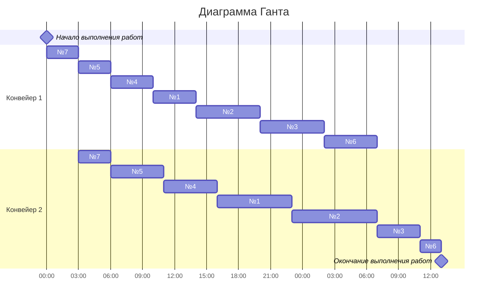

```mermaid
gantt
    title Диаграмма Ганта - Ленточная стратегия для 5 исполнителей
    todayMarker off
    dateFormat  HH:mm    
    axisFormat %H:%M
    Начало выполнения работ : milestone, m1, 00:00, 0h
    section Исп. 1
    Задача A            :a1, 00:00, 9h
    section Исп. 2
    Задача B            :b1, 00:00,  6h
    Задача C            :b2, after b1, 3h
    section Исп. 3
    Задача C            :c1, 00:00, 3h
    Задача D            :c2, after c1, 3h
    Задача E            :c3,after c2, 3h
    section Исп. 4
    Задача E            :d1, 00:00, 2h
    Задача F            :d2,after d1, 2h
    Задача G            :d3,after d2, 2h
    Задача H            :d4,after d3, 3h
    section Исп. 5
    Задача I            :e1, 00:00, 4h
    Окончание выполнения работ : milestone, m2, 09:00, 0h
```

# Оптимальное расписание. Ленточная стратегия/Конвейерная задача
## Задание
Для каждого варианта представлены условия для двух задач. Для каждой задачи необходимо: 
1. Выбрать алгоритм решения задачи и обосновать свой выбор.
2. Применить выбранный алгоритм, в решении отобразить ход выполнения алгоритма с подробными комментариями.
3. В ответе указать длительность полученного расписания.
4. В ответе вывести полученное расписание в виде диаграммы Ганта.

### Вариант 1:
1. Имеется 9 независимых заданий и 5 универсальных исполнителей. Длительность заданий: 9, 6, 6, 3, 5, 2, 2, 3, 4.
2. Имеется 7 независимых заданий, каждое из которых состоит из двух последовательных этапов, и 2 исполнителя, исполнитель 1 выполняет только первый этап задания, исполнитель 2 - только второй. Длительность заданий (по этапам): (4, 7), (6, 8), (6, 4), (4, 5), (3, 5), (5, 2), (3, 3).

### Решение для задачи 1:

*Имеется 9 независимых заданий и 5 универсальных исполнителей. Длительность заданий: 9, 6, 6, 3, 5, 2, 2, 3, 4.*

**1. Выбрать алгоритм решения задачи и обосновать свой выбор.**
Для первой задачи подходит Ленточнный алгоритм, так как имеется 5 (более двух) исполнителей. Задания выполняются независимо друг от друга.
**2. Применить выбранный алгоритм, в решении отобразить ход выполнения алгоритма с подробными комментариями.**
1. Необходимо выбрать наибольшую длительность Tmax среди заданий.    
$$T_{max} = 9$$  
2. Необходимо рассчитать среднюю продолжительность заданий для одного исполнителя Tavg, то есть разделить сумму продолжительностей заданий на количество исполнителей.  
$$T_{avg} = (9+6+6+3+5+2+2+3+4) / 5 = 8$$  

3. Длительность оптимального расписания Topt определяется как максимум из рассчитанных ранее средней продолжительности для исполнителя и наибольшей длительности заданий.  
$$T_{opt} = max(8,9)  = 9$$  
**3. Диаграмма Ганта:**

**4.Ответ:**
Минимальная длительность оптимального расписания - 9 часов.

### Решение для задачи 2:
**1. Выбрать алгоритм решения задачи и обосновать свой выбор.**
Для второй задачи подходит конвейерный алгоритм, так как имеется 2 исполнителя и задания выполняются последовательно.
**2. Применить выбранный алгоритм, в решении отобразить ход выполнения алгоритма с подробными комментариями.**
Пусть a_i и b_i — это длительности первого и второго этапов i-го задания.
*Разобьём список всех заданий на две группы. В первую группу попадают задания, у которых аi <= bi. Во вторую группу - все остальные задания.*
|1 группа|2 группа|
|-|-|
|№1 - (4,7)|№3 - (6,4)|
|№2 - (6,8)|№6 - (5,2)|
|№4 - (4,5)|
|№5 - (3,5)|
|№7 - (3,3)|

*Задания из первой группы отсортируем в порядке возрастания величин аi. Задания из второй группы отсортируем в порядке убывания величин bi.*
|$${a_i} <= {b_i}$$|$${a_i} > {b_i}$$|
|-|-|
|№7 - (3,3)|№3 - (6,4)|
|№5 - (3,5)|№6 - (5,2)|
|№4 - (4,5)|
|№1 - (4,7)|
|№2 - (6,8)|

*Таким образом, порядок выполнения работ будет следующий:*
- №7
- №5
- №4
- №1
- №2
- №3
- №6

**3. Диаграмма Ганта:**

**4.Ответ:**
Минимальная длительность выоплнения работ: **37 часов**
