### Вариант 7:
1. Имеется 7 независимых заданий и 5 универсальных исполнителей. Длительность заданий: 10, 6, 4, 4, 8, 7, 6.
2. Имеется 9 независимых заданий, каждое из которых состоит из двух последовательных этапов, и 2 исполнителя, исполнитель 1 выполняет только первый этап задания, исполнитель 2 - только второй. Длительность заданий (по этапам): (5, 7), (6, 6), (7, 4), (6, 7), (7, 8), (4, 5), (8, 9), (5, 4), (3, 4).

# Задача 1
### Условие:   
Имеется 7 независимых заданий и 5 универсальных исполнителей. Длительность заданий: A(10), B(6), C(4), D(4), E(8), F(7), G(6).
  
### Выбор алгоритма:  
Это первая модельная задача, так как исполнители универсальны, прерывания не запрещены и задания независимы. Поэтому необходимо использовать ленточную стратегию для решения
  
## Решение
### 1.  Выберем наибольшую длительность T<sub>max</sub> среди заданий. Это работа A = 10.

$$
T_{max} = 10 
$$

### 2.  Рассчитаем среднюю продолжительность заданий для одного исполнителя T<sub>avg</sub>.

$$
T_{avg} = \frac{\sum t}{k} = \frac{45}{5}=9 \\
$$

### 3.  Определим длительность оптимального расписания T<sub>opt</sub>.

$$  
T_{opt} = max(T_{max} , T_{avg})\\
T = max(10, 9) = 10
$$   

### 4. Распределим между исполнителями задания по порядку, строим диаграмму Ганта  
  
  ```mermaid
---
    displayMode: compact
---
gantt
    todayMarker off
    title Диаграмма Ганта - Ленточная стратегия для 5 исполнителей
    dateFormat HH:mm  
    axisFormat %H
    Начало выполнения работ : milestone, m1, 00:00, 0h
    section I
    задача A         :a1, 00:00, 10h
    section II
    задача B         :b0, 00:00, 6h
    задача C         :b1, after b0, 4h
    section III
    задача D         :c0, 00:00, 4h
    задача E         :c1, after c0, 6h
    section IV
    задача E         :d0, 00:00, 2h
    задача F         :d1, after d0, 7h
    задача G         :d2, after d1, 1h
    section V
    задача G 		 :f0, 00:00, 5h
    
    Окончание выполнения работ : milestone, m3, 10:00, 0h
```

### Ответ:  10 часов

# Задача 2
### Условие: 
Имеется 9 независимых заданий, каждое из которых состоит из двух последовательных этапов, и 2 исполнителя, исполнитель 1 выполняет только первый этап задания, исполнитель 2 - только второй. Длительность заданий (по этапам): A(5, 7), B(6, 6), C(7, 4), D(6, 7), E(7, 8), F(4, 5), G(8, 9), H(5, 4), I(3, 4).

### Выбор алгоритма:
Это вторая модельная задача (конвейерная), так как задания состоят из двух этапов, прерывания запрещены, количество работников строго 2 и каждый работник выполняет только свою работу. Поэтому необходимо использовать алгоритм Джонсона для решения.
## Решение
### 1.  Разделим задания на 2 группы. В первой - а<sub>i</sub> <= b<sub>i</sub>, а во второй - а<sub>i</sub> > b<sub>i</sub>.

| I         | II       |
|-----------|----------|
|  A(5;7)   |  C(7;4)  |
|  B(6;6)   |  H(5;4)  |
|  D(6;7)   |          |
|  E(7;8)   |          |
|  F(4;5)   |          |
|  G(8;9)   |          |
|  I(3;4)   |          |

### 2.  Сортируем задания первой группы по возрастанию длительности 1-го этапа, а задания второй группы по убыванию длительности 2-го этапа.

**По возрастанию первого этапа:** I(3;4), F(4;5), A(5;7), B(6;6), D(6;7), E(7;8), G(8;9)  
**По убыванию второго этапа:** C(7;4), H(5;4)

### 3. Строим диаграмму Ганта.

```mermaid
---
    displayMode: compact
---
gantt
    todayMarker off
    title Диаграмма Ганта - Алгоритм Джонсона для 2 исполнителей
    dateFormat HH:mm 
    axisFormat %H
    Начало выполнения работ : milestone, m1, 00:00, 0h
    section I
    I         :a1, 00:00, 3h
    F         :a2, after a1, 4h
    A         :a3, after a2, 5h
    B         :a4, after a3, 6h
    D         :a5, after a4, 6h
    E         :a6, after a5, 7h
    G         :a7, after a6, 8h
    C         :a8, after a7, 7h
    H         :a9, after a8, 5h
    -         :a10, after a9, 6h
    section II
    -         :b0, 00:00, 3h
    I         :b1, after b0, 4h
    F         :b2, after b1, 5h
    A         :b3, after b2, 7h
    B         :b4, after b3, 6h
    D         :b5, after b4, 7h
    E         :b6, after b5, 8h
    G         :b7, after b6, 9h
    C         :b8, after b7, 4h
    H         :b9, after b8, 4h
    Окончание выполнения работ : milestone, m2, after b9, 0h
```


### Ответ: 57 часов
