## Задание
Для каждого варианта представлены условия для двух задач. Для каждой задачи необходимо: 
1. Выбрать алгоритм решения задачи и обосновать свой выбор.
2. Применить выбранный алгоритм, в решении отобразить ход выполнения алгоритма с подробными комментариями.
3. В ответе указать длительность полученного расписания.
4. В ответе вывести полученное расписание в виде диаграммы Ганта.

### Вариант 9:
1. Имеется 9 независимых заданий, каждое из которых состоит из двух последовательных этапов, и 2 исполнителя, исполнитель 1 выполняет только первый этап задания, исполнитель 2 - только второй. Длительность заданий (по этапам): A(6, 9), B(3, 6), C(7, 8), D(5, 4), E(6, 7), F(6, 4), G(4, 2), H(3, 3), I(9, 7).
2. Имеется 7 независимых заданий и 4 универсальных исполнителя. Длительность заданий: A4, B4, C8, D7, E6, F7, G4.

## Задача 1:
Для первого задания подходит алгоритм джонсона, так как она конвейерная.
### Тогда получим две группы:
| 1      | 2      |
|--------|--------|
| A(6,9) | D(5,4) |
| B(3,6) | F(6,4) |
| C(7,8) | G(4,2) |
| E(6,7) | I(9,7) |
| H(3,3) |        |

### Отсортируем их:
| 1      | 2      |
|--------|--------|
| H(3,3) | I(9,7) |
| B(3,6) | F(6,4) |
| E(6,7) | D(5,4) |
| A(6,9) | G(4,2) |
| C(7,8) |        |

### Тогда порядок работ будет следующим по диаграмме ганта:

### Длительность выполнения работ:
35 часов

## Задача 2:
Так как исполнители - универсалы, выбираем ленточную стратегию

$$T_{max} = 8$$
$$T_{avg} = (4+4+8+7+6+7+4) / 4 = 10$$

$$T_{opt} = max(8, 10) = 10$$

```mermaid
gantt
    title Диаграмма Ганта - Ленточная стратегия для 4 исполнителей
    dateFormat  HH:mm    
    axisFormat %H:%M
    Начало выполнения работ : milestone, m1, 00:00, 0h
    section Исполнитель 1
    C 8           :a1, 00:00, 8h
    D 7           :a2, after a1, 1h
    F 7           :a3, after a2, 1h
    section Исполнитель 2
    D 7        :b1, 00:00,  6h
    A 4        :b2, after b1,  4h
    section Исполнитель 3
    F 7        :c1, 00:00, 6h
    B 4        :c2, after c1, 4h
    section Исполнитель 4
    E 6        :d1, 00:00, 6h
    G 4        :d2,after d1, 4h
    Окончание выполнения работ : milestone, m2, 10:00, 0h
```

### Длительность выполнения работ:
10 часов