# Оптимальное расписание. Ленточная стратегия/Конвейерная задача
## Задание
Для каждого варианта представлены условия для двух задач. Для каждой задачи необходимо: 
1. Выбрать алгоритм решения задачи и обосновать свой выбор.
2. Применить выбранный алгоритм, в решении отобразить ход выполнения алгоритма с подробными комментариями.
3. В ответе указать длительность полученного расписания.
4. В ответе вывести полученное расписание **в виде диаграммы Ганта**. 
### Вариант 8:
1. Имеется 9 независимых заданий и 4 универсальных исполнителя. Длительность заданий: 5, 6, 5, 11, 6, 6, 17, 7, 9.
2. Имеется 9 независимых заданий, каждое из которых состоит из двух последовательных этапов, и 2 исполнителя, исполнитель 1 выполняет только первый этап задания, исполнитель 2 - только второй. Длительность заданий (по этапам): (8, 9), (6, 8), (3, 5), (8, 7), (4, 6), (6, 10), (7, 4), (7, 5), (5, 8).
### Решение для задачи 1:
Для первой задачи подходит Ленточная стратегия, так как исполнители универсальны и задания независимы.
1. Необходимо выбрать наибольшую длительность Tmax среди заданий.    
$$T_{max} = 17$$  
2. Необходимо рассчитать среднюю продолжительность заданий для одного исполнителя Tavg, то есть разделить сумму продолжительностей заданий на количество исполнителей.  
$$T_{avg} = (5+6+5+11+6+6+17+7+9) / 4 = 18$$  

3. Длительность оптимального расписания Topt определяется как максимум из рассчитанных ранее средней продолжительности для исполнителя и наибольшей длительности заданий.  
$$T_{opt} = max(17,18)  = 18$$  
**Диаграмма Ганта:**

**4.Ответ: 18 часов**
### Решение для задачи 2:
**Данные**: 9 заданий, каждое из которых состоит из двух этапов. Длительности: (8, 9), (6, 8), (3, 5), (8, 7), (4, 6), (6, 10), (7, 4), (7, 5), (5, 8).
**Алгоритм Джонсона:**
Алгоритм Джонсона идеально подходит для первой задачи, поскольку она представляет собой конвейерный процесс. В этой задаче задействованы два исполнителя, каждый из которых специализируется исключительно на своем виде работы.
**Реализация:**
Допустим, $a_{i}$​ и $b_{i}$​ обозначают продолжительность первого и второго этапов i-го задания соответственно. Мы разделим все задания на две категории. Задания, для которых выполняется условие $a_{i}​$≤$b_{i}​$, будут отнесены к первой группе. Все оставшиеся задания будут включены во вторую группу.
|1 группа|2 группа|
|-|-|
|№1 - (8,4)|№4 - (8,7)
|№2 - (6,8)|№7 - (7,4)
|№3 - (3,5)||№8 - (7,5)
|№5 - (6,7)||
|№6 - (6,10)||
|№9 - (5,8)||

Задания из первой группы отсортируем в порядке возрастания величин $а_{i}$. Задания из второй группы отсортируем в порядке убывания величин $b_{i}$.*
|$${a_i} <= {b_i}$$|$${a_i} > {b_i}$$|
|-|-|
|№6 - (6,10)|№7 - (7,4)
|№1 - (8,9)|№8 - (7,5)
|№2 - (6,8)|№4 - (8,7)
|№9 - (5,8)|
|№5 - (4,6)|
|№3 - (3,5)||

*Таким образом, порядок выполнения работ будет следующий:*
- №6
- №1
- №2
- №9
- №5
- №3
- №7
- №8
- №4
**Диаграмма Ганта:**

```mermaid
gantt
title Конвейерная задача
dateFormat HH:mm
axisFormat %H:%M
section Первый этап
Задание 6 :a1, 00:00 , 6h
Задание 1 :a2, after a1, 8h
Задание 2 :a3, after a2, 6h
Задание 9 :a4, after a3, 5h
Задание 5 :a5, after a4, 4h
Задание 3 :a6, after a5, 3h
Задание 7 :a7, after a6, 7h
Задание 8 :a8, after a7, 7h
Задание 4 :a9, after a8, 8h
section Второй этап
Задание 6 :b1, after a1, 10h
Задание 1 :b2, after b1, 9h
Задание 2 :b3, after b2, 8h
Задание 9 :b4, after b3, 8h
Задание 5 :b5, after b4, 6h
Задание 3 :b6, after b5, 5h
Задание 7 :b7, after b6, 4h
Задание 8 :b8, after b7, 5h
Задание 4 :b9, after b8, 7h
```

**4.Ответ: 68 часов**
