# Оптимальное расписание. Ленточная стратегия/Конвейерная задача  
## Задание  
Для каждого варианта представлены условия для двух задач. Для каждой задачи необходимо:   
1. Выбрать алгоритм решения задачи и обосновать свой выбор.  
2. Применить выбранный алгоритм, в решении отобразить ход выполнения алгоритма с подробными комментариями.  
3. В ответе указать длительность полученного расписания.  
4. В ответе вывести полученное расписание в виде диаграммы Ганта.  
  
### Вариант 5:  
1. Имеется 8 независимых заданий, каждое из которых состоит из двух последовательных этапов, и 2 исполнителя, исполнитель 1 выполняет только первый этап задания, исполнитель 2 - только второй. Длительность заданий (по этапам): (4, 9), (7, 5), (3, 4), (7, 6), (4, 3), (5, 2), (5, 7), (10, 8).  
2. Имеется 8 независимых заданий и 4 универсальных исполнителя. Длительность заданий: 11, 7, 9, 7, 6, 5, 5, 6].

# Задача 1

### Условие: 
Имеется 8 независимых заданий, каждое из которых состоит из двух последовательных этапов, и 2 исполнителя, исполнитель 1 выполняет только первый этап задания, исполнитель 2 - только второй. Длительность заданий (по этапам): A(4, 9), B(7, 5), C(3, 4), D(7, 6), E(4, 3), F(5, 2), G(5, 7), H(10, 8).  

### Выбор алгоритма:
Это вторая математическая задача (конвейерная), следовательно, необходимо использовать алгоритм Джонсона, потому что в этой задаче у каждого задания два этапа, а каждый из исполнителей может выполнять только свою работу

## I этап - разбиваем все задания на две группы

| I$\leq$II | I $>$ II |
|-----------|----------|
|  A(4;9)   |  B(7;5)  |
|  C(3;4)   |  D(7;6)  |
|  G(5;7)   |  E(4;3)  |
|           |  F(5;2)  |
|           |  H(10;8) |

I - Первый этап работы
II - Второй этап работы

## II этап - сортируем задания первой группы по возрастанию длительности I-го этапа, а задания второй группы по убыванию длительности II-го этапа

| I$\leq$II | I $>$ II |
|-----------|----------|
|  C(3;4)   |  H(10;8) |
|  A(4;9)   |  D(7;6)  |
|  G(5;7)   |  B(7;5)  |
|           |  E(4;3)  |
|           |  F(5;2)  |

## III этап - строим диаграмму Ганта

```mermaid
---
    displayMode: compact
---
gantt
    
    title Диаграмма Ганта - Алгоритм Джонсона для 2 исполнителей
    dateFormat HH:mm  
    axisFormat %a %H
    Начало выполнения работ : milestone, m1, 00:00, 0h
    section I
    C         :a1, 00:00, 3h
    A         :a2, after a1, 4h
    G         :a3, after a2, 5h
    H         :a4, after a3, 10h
    D         :a5, after a4, 7h
    B         :a6, after a5, 7h
    E         :a7, after a6, 4h
    F         :a8, after a7, 5h
    -         :a9, after a8, 2h
    section II
    -         :b0, 00:00, 3h
    C         :b1, after b0, 4h
    A         :b2, after b1, 9h
    G         :b3, after b2, 7h
    H         :b4, after b3, 8h
    D         :b5, after b4, 6h
    B         :b6, after b5, 5h
    E         :b7, after b6, 3h
    F         :b8, after b7, 2h
    section
    
    Окончание выполнения работ : milestone, m2, after b8, 0h
```


### Ответ 
47 часов
# Задача 2 
  
### Условие:   
Имеется 8 независимых заданий и 4 универсальных исполнителя. Длительность заданий: A(11), B(7), C(9), D(7), E(6), F(5), G(5), H(6).    
  
### Выбор алгоритма:  
Это первая математическая задача, следовательно, необходимо использовать ленточную стратегию, потому что в этой задаче независимые задания, а про прерывания ничего не сказано, значит прерывать можно  
  
## I этап - определяем время, необходимое для решения всех заданий 

$$T = max(T_{ср};T_{max}) \\
T_{ср} = \frac{\sum t}{4} = \frac{56}{4}=14 \\
T_{max} = 11 \\
T = max(14;11) = 14$$
  
## II этап - распределяем между исполнителями задания по порядку $\rightarrow$ строим диаграмму Ганта  
  
  ```mermaid
---
    displayMode: compact
---
gantt
    
    title Диаграмма Ганта - Ленточная стратегия для 4 исполнителей
    dateFormat HH:mm  
    axisFormat %H
    Начало выполнения работ : milestone, m1, 00:00, 0h
    section I
    A         :a1, 00:00, 11h
    B         :a2, after a1, 3h
    section II
    B         :b0, 00:00, 4h
    C         :b1, after b0, 9h
    D         :b2, after b1, 1h
    section III
    D         :c0, 00:00, 6h
    F         :c1, after c0, 5h
    G         :c2, after c1, 3h
    section IV
    G         :d0, 00:00, 2h
    H         :d1, after d0, 6h
    E         :d2, after d1, 6h
    section
    
    Окончание выполнения работ : milestone, m3, after d2, 0h
```