## Вариант 7:
Стратегия: лексикографическая

Количество задач: 15

Количество транзитивных ребер: 1

Количество исполнителей: 2

## 1.  Таблица зависимостей

| Предшествующее задание | A | A | A | B | C | D | D | E | F | F | G | H | I | J | K | L | M |
|------------------------|---|---|---|---|---|---|---|---|---|---|---|---|---|---|---|---|---|
| Последующее задание    | D | E | I | E | F | G | H | I | I | J | K | L | M | N | O | O | O |

## 2.  Граф зависимостей

## 3. Подготовка графа зависимостей для лексикографической стратегии

Удаляем транзитивное ребро A -- I.

### Построим граф зависимостей с приоритетами:

Приоритет: #

Строка приоритетов прямых потомков: <>

##  4. Построим расписание выполнения задач

```mermaid
gantt
    
    title Диаграмма Ганта
    dateFormat HH:mm    
    axisFormat %H:%M
    Начало выполнения работ : milestone, m1, 00:00, 0h
    section Исполнитель 1
    A(15)         :c, 00:00, 1h
    B(13)         :i, after c, 1h    
    D(11)         :e, after i, 1h    
    J(9)         :h, after e, 1h
    H(7)         :a, after h, 1h
    M(5)         :b, after a, 1h
    K(3)         :k, after b, 1h
    O(1)         :O, after k, 1h
    section Исполнитель 2
    C(14)         :d, 00:00, 1h
    F(12)         :f, after d, 1h
    E(10)         :l, after f, 1h
    I(8)         :g, after l, 1h
    G(6)         :j, after g, 1h
    L(4)         :x, after j, 1h
    N(2)         :y, after x, 1h
    Окончание выполнения работ : milestone, m2, 08:00, 0h
```

### Ответ: расписание, составленное по лексикографической стратегии, имеет длительность в 8 ед. времени.