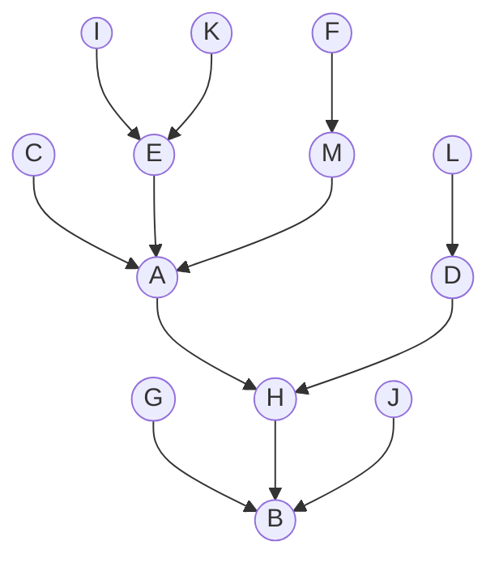
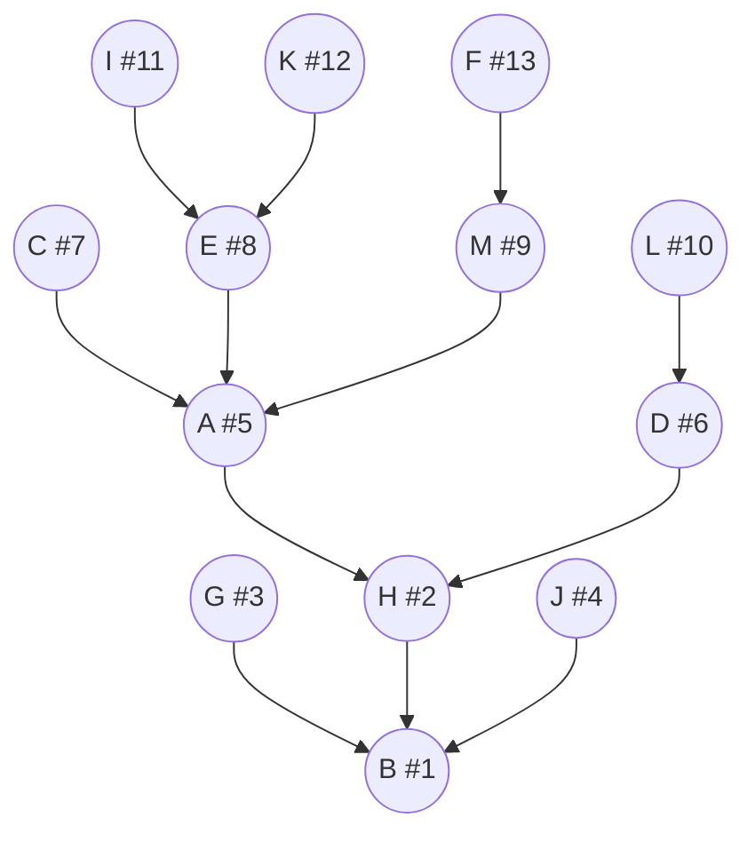

### Вариант 2 (видоизменный, +2 исполнителя) : 
- Стратегия: уровневая
- Количество задач: 13
- Количество исполнителей: 4
- Количество деревьев: 1

## Решение:
### 1.  Таблица зависимостей

| Предшествующее задание | A | B | C | D | E | F | G | H | I | J | K | L | M |
|------------------------|---|---|---|---|---|---|---|---|---|---|---|---|---|
| Последующее задание    | H | - | A | H | A | M | B | B | E | B | E | D |  |

### Граф зависимостей

###  2. Для решения используется уровневая стратегия, поэтому необходимо расставить приоритеты.
1. Приоритет 1 отдаем корню B
2.  Претенденты для приоритета 2: G, H, J. Приоритет отдается тому у кого самый слабый потомок, а так как потомки одинаковой силы, то приоритет 2 можно отдать H.
3.  Претенденты для приоритета 3: G, J, A, D. Приоритет 3 отдаем G.
4.  Претенденты для приоритета 4: J, A, D. Приоритет 4 отдаем J.
5.  Претенденты для приоритета 5: A, D. Приоритет 5 отдаем A.
6.  Претенденты для приоритета 6: D, C, E, M. Приоритет 6 отдаем D.
7.  Претенденты для приоритета 7: C, E, M, L. Приоритет 7 отдаем C.
8.  Претенденты для приоритета 8: E, M, L, . Приоритет 8 отдаем E.
9.  Претенденты для приоритета 9: I, K, M, L. Приоритет 9 отдаем M.
10.  Претенденты для приоритета 10: L. Приоритет 10 отдаем L.
11.  Претенденты для приоритета 11: I, K, F. Приоритет 11 отдаем I.
12.  Претенденты для приоритета 12: K, F. Приоритет 12 отдаем K.
13.  Претенденты для приоритета 13: F. Приоритет 13 отдаем F.

###  3. Таким образом, получаем граф зависимостей с приоритетами.

###  4. Построим диаграмму Ганта
### Строим диаграмму Ганта для четырех исполнителей, распределяя задачи исполнителям с наибольшим приоритетом в первую очередь.

```mermaid
gantt
    
    title Диаграмма Ганта
    dateFormat HH:mm    
    axisFormat %H:%M
    Начало выполнения работ : milestone, m1, 00:00, 0h
    section 1-ый Исполнитель 
    F(13)         :c, 00:00, 1h
    C(7)         :i, after c, 1h    
    D(6)         :e, after i, 1h    
    H(2)         :h, after e, 1h
    B(1)         :a, after h, 1h
    section 2-ой Исполнитель 2
    K(12)         :d, 00:00, 1h
    E(8)         :f, after d, 1h
    A(5)         :l, after f, 1h
    section 3-ий Исполнитель 
    I(11)          :c, 00:00, 1h
    M(9)         :i, after c, 1h    
    J(4)         :e, after i, 1h    
    section 4-ый Исполнитель 
    L(10)          :d, 00:00, 1h
    G(3)         :f, after d, 1h
    Окончание выполнения работ : milestone, m2, 06:00, 0h
```

###  *Ответ:  кратчайшее расписание имеет длительность 5.*
