### Сами придумали(уровневая): 
- Стратегия: уровневая
- Количество задач: 16
- Количество исполнителей: 3
- Количество деревьев: 1
## Решение
### 1.  Таблица зависимостей

| Предшествующее задание | B | C | D | E | F | G | H | I | J | P | K | L | M | N | O |
|------------------------|---|---|---|---|---|---|---|---|---|---|---|---|---|---|---|---|
| Последующее задание    | A | А | A | B | B | B | C | C | E | J | E | G | G | H | H |
### Граф зависимостей
~~~mermaid
graph  TD
B((B))  -->  A((A))
C((C))  -->  A((A))
D((D))  -->  A((A))
E((E))  -->  B((B))
F((F))  -->  B((B))
P((P))  -->  J((J))
G((G))  -->  B((B))
H((H))  -->  C((C))
I((I))  -->  C((C))
J((J))  -->  E((E))
K((K))  -->  E((E))
L((L))  -->  G((G))
M((M))  -->  G((G))
N((N))  -->  H((H))
O((O))  -->  H((H))
~~~
###  2. Для решения используется уровневая стратегия, поэтому необходимо расставить приоритеты.
1. Приоритет 1 отдаем корню A
2. Приоритет отдаем узлу с прямым потомком с меньшим приоритетом 
3. Берем свободные задачи с наибольшим приоритетом
###  3. Таким образом, получаем граф зависимостей с приоритетами.
~~~mermaid
graph  TD
B((B,1))  -->  A((A,1))
C((C,3))  -->  A((A,1))
D((D,4))  -->  A((A,1))
E((E,5))  -->  B((B,2))
F((F,6))  -->  B((B,2))
P((P,16))  -->  J((J,10))
G((G,7))  -->  B((B,2))
H((H,8))  -->  C((C,3))
I((I,9))  -->  C((C,3))
J((J,10))  -->  E((E,5))
K((K,11))  -->  E((E,5))
L((L,12))  -->  G((G,7))
M((M,13))  -->  G((G,7))
N((N,14))  -->  H((H,8))
O((O,15))  -->  H((H,8))
~~~

```mermaid
gantt
title Диаграмма Ганта
dateFormat HH:mm
axisFormat %H:%M
Начало выполнения работ : milestone, m1, 00:00, 0h
section Исполнитель 1
P(16) :a1, 00:00, 1h
M(13) :a2, after a1, 1h
J(10) :a3, after a2, 1h
G(7) :a4, after a3, 1h
D(4) :a5, after a4, 1h
A(1) :a6, after a5, 1h
section Исполнитель 2
O(15) :b1, 00:00, 1h
L(12) :b2, after b1, 1h
I(9) :b3, after b2, 1h
F(6) :b4, after b3, 1h
C(3) :b5, after b4, 1h
section Исполнитель 3
N(14) :c1, 00:00, 1h
K(11) :c2, after c1, 1h
H(8) :c3, after c2, 1h
E(5) :c4, after c3, 1h
B(2) :c5, after c4, 1h
Окончание выполнения работ : milestone, a6, 06:00, 0h
```

###  Ответ:  кратчайшее расписание имеет длительность 6.