### Сами придумали(уровневая): 
- Стратегия: уровневая
- Количество задач: 18
- Количество исполнителей: 3
- Количество деревьев: 1
## Решение
### 1.  Таблица зависимостей

| Предшествующее задание | A | B | C | D | E | F | G | H | I | J | K | L | M |N|O|P|Q|R|
|------------------------|---|---|---|---|---|---|---|---|---|---|---|---|---|---|---|---|---|---|
| Последующее задание    | - | А | C | B | B,C | C | D | D | E | E | F | F | G,H |I,J |K,L|M|N|O|
### Граф зависимостей
~~~mermaid
graph  TB

B((B))  -->  A((A))

C((C))  -->  A((A))

D((D))  -->  B((B))

E((E))  -->  C((C))

E((E))  -->  B((B))

F((F))  -->  C((C))

G((G))  -->  D((D))

H((H))  -->  D((D))

I((I))  -->  E((E))

J((J))  -->  E((E))

K((K))  -->  F((F))

L((L))  -->  F((F))

M((M))  -->  G((G))

M((M))  -->  H((H))

N((N))  -->  I((I))

N((N))  -->  J((J))

O((O))  -->  K((K))

O((O))  -->  L((L))

P((P))  -->  M((M))

Q((Q))  -->  N((N))

R((R))  -->  O((O))
~~~
###  2. Для решения используется уровневая стратегия, поэтому необходимо расставить приоритеты.
1. Приоритет 1 отдаем корню A
2. Приоритет отдаем узлу с прямым потомком с меньшим приоритетом 
3. Берем свободные задачи с наибольшим приоритетом
###  3. Таким образом, получаем граф зависимостей с приоритетами.
~~~mermaid
graph  TB

B((B,2))  -->  A((A,1))

C((C,3))  -->  A((A,1))

D((D,4))  -->  B((B,2))

E((E,5))  -->  C((C,3))

E((E,5))  -->  B((B,2))

F((F,6))  -->  C((C,3))

G((G,7))  -->  D((D,4))

H((H,8))  -->  D((D,4))

I((I,9))  -->  E((E,5))

J((J,10))  -->  E((E,5))

K((K,11))  -->  F((F,6))

L((L,12))  -->  F((F,6))

M((M,13))  -->  G((G,7))

M((M,13))  -->  H((H,8))

N((N,14))  -->  I((I,9))

N((N,14))  -->  J((J,10))

O((O,15))  -->  K((K,11))

O((O,15))  -->  L((L,12))

P((P,16))  -->  M((M,13))

Q((Q,17))  -->  N((N,14))

R((R,18))  -->  O((O,15))
~~~

```mermaid
gantt
title Диаграмма Ганта
dateFormat HH:mm
axisFormat %H:%M
Начало выполнения работ : milestone, m1, 00:00, 0h
section Исполнитель 1
R(18) :a1, 00:00, 1h
O(15) :a2, after a1, 1h
L(12) :a3, after a2, 1h
I(9) :a4, after a3, 1h
F(6) :a5, after a4, 1h
C(3) :a6, after a5, 1h
A(1) :a7, after a6, 1h
section Исполнитель 2
Q(17) :b1, 00:00, 1h
N(14) :b2, after b1, 1h
K(11) :b3, after b2, 1h
H(8) :b4, after b3, 1h
E(5) :b5, after b4, 1h
B(2) :b6, after b5, 1h
section Исполнитель 3
P(16) :c1, 00:00, 1h
M(13) :c2, after c1, 1h
J(10) :c3, after c2, 1h
G(7) :c4, after c3, 1h
D(4) :c5, after c4, 1h
Окончание выполнения работ : milestone, m2, 07:00, 0h
```

###  Ответ:  кратчайшее расписание имеет длительность 7.
