# Оптимальное расписание. Лексикографическая стратегия/Уровневая стратегия
## Задание
Для каждого варианта необходимо придумать и решить задачу для указанной стратегии с указанными ограничениями: 
1. Сформулировать условия задачи согласно теме и указанным ограничениям.
2. Оформить решение задачи по шагам с подробными комментариями.
3. Граф зависимостей для задачи и модификацию данного графа в ходе решения оформлять в виде диаграммы.
4. В ответе указать длительность полученного расписания.
5. В ответе вывести полученное расписание **в виде диаграммы Ганта**.

### Вариант 2: 
- Стратегия: уровневая
- Количество задач: 13
- Количество исполнителей: 2 
- Количество деревьев: 1

## Условие:
### Граф зависимостей

## I Шаг

### Первый приоритет отдаём корню дерева R

## II Шаг

### Определяем приоритет для остальных вершин по их прямым потомкам по наименьшему приоритету

{A,B,C} - у каждой вершины потомок R с приоритетом 1, поэтому можно в любой последовательности выдать приоритеты
Допустим:
A - 2
B - 3
C - 4

Получаем:

## III Шаг

### Определяем приоритет у остальных вершин по такому же принципу

Тогда

Получаем:

## IV Шаг

### Строим диаграмму Ганта для двух исполнителей, распределяя задачи исполнителям с наибольшим приоритетом в первую очередь

### Диаграмма Ганта

```mermaid
gantt
    
    title Диаграмма Ганта
    dateFormat HH:mm    
    axisFormat %H:%M
    Начало выполнения работ : milestone, m1, 00:00, 0h
    section Исполнитель 1
    L(13)         :c, 00:00, 1h
    J(11)         :i, after c, 1h    
    H(9)         :e, after i, 1h    
    F(7)         :h, after e, 1h
    D(5)         :a, after h, 1h
    B(3)         :b, after a, 1h
    R(1)         :k, after b, 1h
    section Исполнитель 2
    K(12)         :d, 00:00, 1h
    I(10)         :f, after d, 1h
    G(8)         :l, after f, 1h
    E(6)         :g, after l, 1h
    C(4)         :j, after g, 1h
    A(2)         :x, after j, 1h
    -            :y, after x, 1h
    Окончание выполнения работ : milestone, m2, 07:00, 0h
```

## Ответ:
T = 7 часов
