# Оптимальное расписание. Лексикографическая стратегия/Уровневая стратегия
## Лексикографическая стратегия
### Постановка задачи:
1. количество заданий произвольно;`
2. все задания имеют одинаковую длительность;
3. задания зависимы, причём **граф зависимостей не должен содержать транзитивных ребер**;
4. запрещены прерывания при выполнении заданий;
5. количество **работников строго 2**;
6. работники универсальны;
7. производительность работников, размеры оплаты из труда и т.д. не учитываются;

*Требуется построить расписание выполнения всех заданий для заданного 
количества исполнителей в кратчайшие сроки.*

### Алгоритм решения задачи
Перед выполнением алгоритма необходимо удалить из графа зависимостей транзитивные ребра.

Для построения расписания необходимо назначить приоритет для каждой задачи. В первую очередь приоритеты 1, 2, 3, ... назначаются стокам графа (вершины, из которых нет исходящих ребер). 

Для заданий, все прямые потомки которых уже имеют приоритеты, составляется строка из приоритетов прямых потомков, записанных в убывающем порядке. Приоритет (t + 1) назначается заданию, у которого строка из приоритетов является лексикографически наименьшей.

После того как приоритеты для всех задач назначены, задачи добавляются в расписание в соответствии с их приоритетом. В каждый момент времени выбираются задачи готовые к выполнению (для которых все предшествующие задачи выполнены к началу момента времени) из них для добавления в расписание выбирается задача с наибольшим приоритетом.
## Задание
Для каждого варианта необходимо придумать и решить задачу для указанной стратегии с указанными ограничениями: 
1. Сформулировать условия задачи согласно теме и указанным ограничениям.
2. Оформить решение задачи по шагам с подробными комментариями.
3. Граф зависимостей для задачи и модификацию данного графа в ходе решения оформлять в виде диаграммы.
4. В ответе указать длительность полученного расписания.
5. В ответе вывести полученное расписание **в виде диаграммы Ганта**.

### Вариант 1: 
- Стратегия: лексикографическая
- Количество задач: 15
- Количество транзитивных ребер: 0

## Граф:

## Расставялем приоритеты:

### Строим диаграмму Ганта

```mermaid
gantt
    
    title Диаграмма Ганта
    dateFormat HH:mm    
    axisFormat %H:%M
    Начало выполнения работ : milestone, m1, 00:00, 0h
    section Исполнитель 1
    M(15)        :m, 00:00, 1h
    C(13)        :c, after m, 1h    
    L(11)        :l, after c, 1h    
    E(9)         :e, after l, 1h
    H(8)         :h, after e, 1h
    G(5)         :g, after h, 1h
    K(3)         :k, after g, 1h
    B(1)         :b, after k, 1h
    section Исполнитель 2
    D(12)        :d, 00:00, 1h
    I(14)        :i, after d, 1h
    F(10)        :f, after i, 1h
    P(7)         :p, after f, 1h
    Q(6)         :q, after p, 1h
    A(4)         :a, after q, 1h
    J(2)         :j, after a, 1h
    -            :xyz, after j, 1h
    Окончание выполнения работ : milestone, m2, 08:00, 0h
```

## Ответ:
**Длительность расписания : 8 часов**

