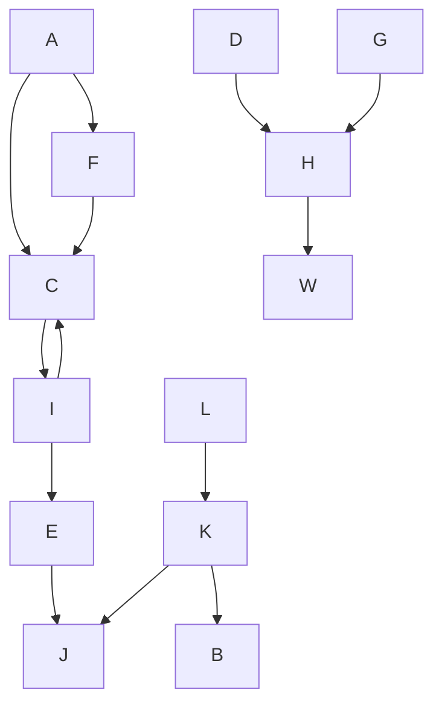
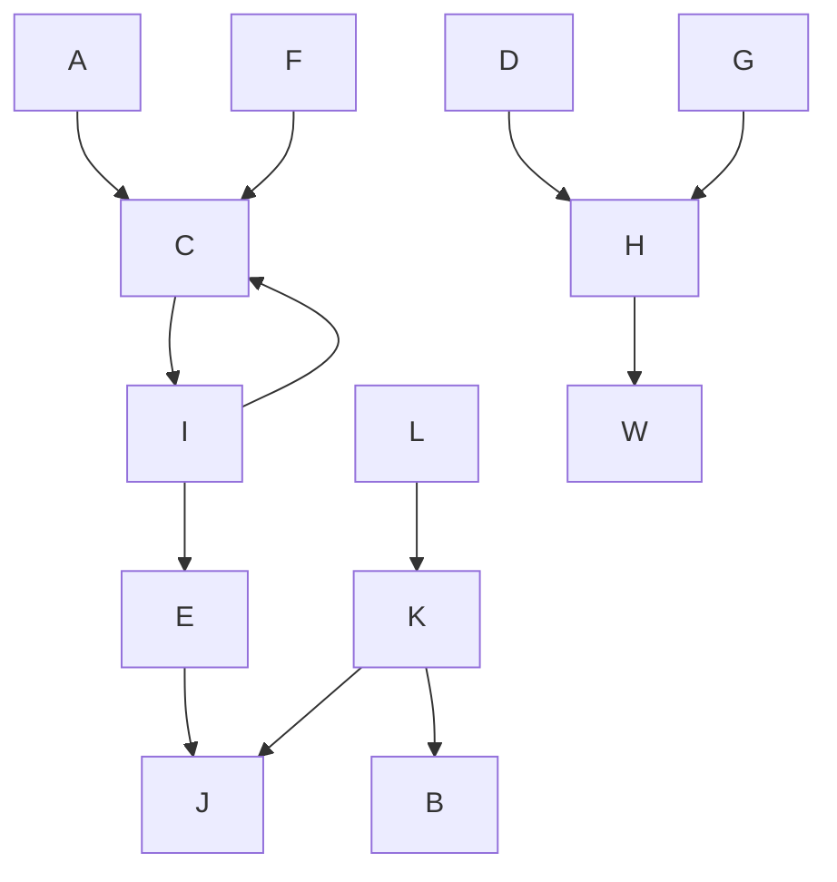
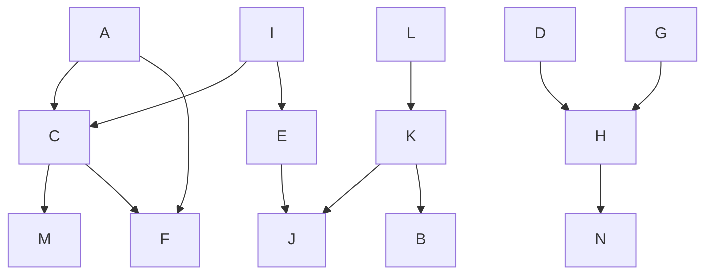

## **Вариант 3**
n = 14 = {A, B, C, D, E, F, G, H, I, J, K, L, M, N}

Необходимо убрать транзитивные дуги, чтобы получить точный результат. (Необходимо убрать дугу AF)
**Итоговая таблица:**

Распределим приоритеты между строками графа: 
F - 1; M - 2; I - 3; B - 4; N - 5

Рассмотрим задания, у которых все прямые потомки уже имеют приоритеты.
Для каждого такого задания составим строку из приоритетов всех его прмых потомков в порядке убывания.
Приоритет назначается заданию, у которого строка является лексикографически наименьшим.

|1|2|3|4|5|  6 |  7 | 8  | 9  | 10  | 11 | 12 | 13 |14|
|-|-|-|-|-|----|----|----|----|-----|----|----|----|--|
|F|M|I|B|N|C:21|E:3 |K:43|H:5 |A:6  |I:76|L:8 |D:9 |G |     
| | | | | |E:3 |K:43|H:5 |A:6 |I:76 |L:8 |D:9 |G:9 |  |
| | | | | |K:43|H:5 |A:6 |I:76|L:8  |D:9 |G:9 |    |  |
| | | | | |H:5 |I:76|I:76|L:8 |D,G:9|G:9 |    |    |  |

**Граф с приоритетами:**

**Составим диаграмму Ганта:**  

| испалнители   |      |      |      |    |   |   |   |
|---------------|------|------|------|----|---|---|---|
| 1 исполнитель | 14   | 12   | 10   | 8  | 6 | 4 | 2 |
| 2 исполнитель | 13   | 11   | 9    | 7  | 5 | 3 | 1 |

Таким образом, лексикографическая стратегия позволила построить оптимальное расписание длительности: 7.
